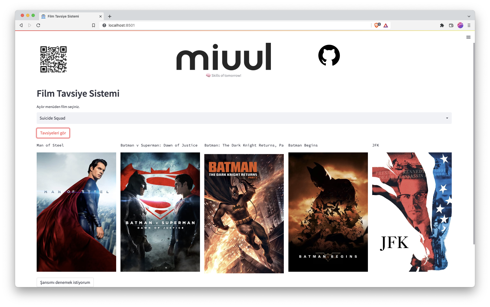

# Movie Recommender



## Film Tavsiye Sistemi Geliştirin

Repoyu aşağıdaki adresten indirelim.

**Gerekli paketleri yükleyelim**

`pip3 install -r requirements.txt`

**Model dosyalarının oluşması için aşağıdaki scripti çalıştıralım.**

`python data_preparation.py`

Aşağıdaki adresten üye olarak API key edinebilirsiniz. Çalışmada kendi API'nizi kullanmanız gerekmekte. 

https://www.themoviedb.org/settings/api

**.env dosyası içerisinde gerekli API kodunu girelim.**

`export MOVIE_API='WRITEYOURAPIKEYHERE’`

**Localde streamlit uygulamasını başlatma**

`streamlit run app.py`


## Heroku ile Uygulamanızı Dış Dünyaya açın

Aşağıdaki adresten Herokuya kayıt olalım.

[https://heroku.com/](https://heroku.com/)

Yeni bir proje oluşturalım.


Projemize bir isim verelim ve lokasyon bilgisini seçerek **Create app** ile devam edelim.


### Install the Heroku CLI

[Heroku CLI](https://devcenter.heroku.com/articles/heroku-command-line)

**Heroku CLI yükleyelim.**

- **Mac:**

`brew tap heroku/brew && brew install heroku`

- **Windows**

Bağlantıdan ilgili exe dosyasını indirip kurulum yapabilir.

İlgili proje dizininde terminal açarak sırasıyla aşağıdaki işlemleri yapalım.

Terminal üzerinden Heroku CLI aktif hale getirme.

`heroku login`


### Heroku üzerinde yeni bir Git Reposu oluşturalım.

Proje dizinimize girerek aşağıdaki kodları çalıştıralım. 

<aside>
💡 Aşağıdaki `movie-recommender-miuul` sizin koyduğunuz proje adı olacak.
</aside>

```
git init
heroku git:remote -a movie-recommender-miuul
```

### Uygulamayı Heroku Reposuna gönderelim.

```
git checkout -b main
git add .
git commit -am "herokuya miuuldan selamlar"
git push heroku main
```

Bu işlem dosya boyutları sebebiyle uzun sürmekte. 

500 MB’lık bir sınır var, bu boyutu aştığımızda hata alıyoruz.


# BINGO!

